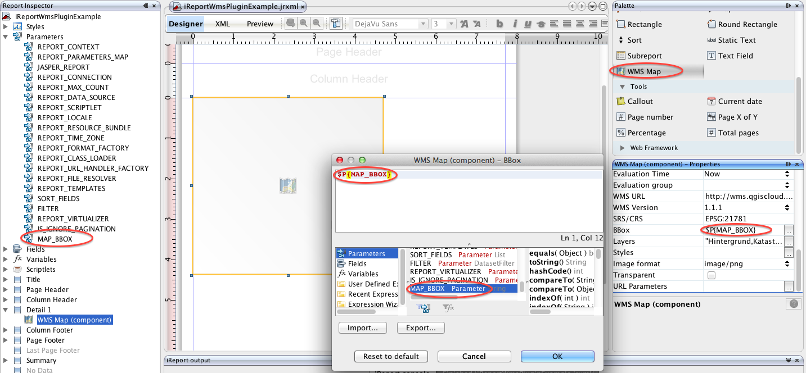

================================================
Web Map Service map extension for Jasper Reports
================================================

`JasperReports`_ is the world's most popular open source reporting engine. It is able to use data coming from any kind of data source and produce pixel-perfect documents that can be viewed, printed or exported in a variety of document formats including HTML, PDF, Excel, OpenOffice and Word. Report templates can be created with the `iReport Designer`_ on the desktop.

This extension allows to embedding maps served with the standardized `Web Map Service (WMS) protocol`_.

WMS protocol
------------

GetMap request example:

http://wms.qgiscloud.com/olten/Solarkataster?SERVICE=WMS&REQUEST=GetMap&LAYERS=Hintergrund,Kataster&FORMAT=image/png&DPI=96&TRANSPARENT=FALSE&VERSION=1.1.1&STYLES=&SRS=EPSG:21781&BBOX=634849.96085766,244281.95484911,635310.33560906,244655.89909163&WIDTH=522&HEIGHT=424

The following WMS parameters can be configured in Jasper Reports:

- WMS_URL: http://wms.qgiscloud.com/olten/Solarkataster
- LAYERS: Hintergrund,Kataster
- FORMAT: image/png
- TRANSPARENT: FALSE
- VERSION: 1.1.1
- SRS: EPSG:21781
- BBOX: 634849.96085766,244281.95484911,635310.33560906,244655.89909163
- DPI: 96

Remarks:

- In WMS version 1.3 the parameter "SRS" has been renamed to "CRS".
- The DPI parameter is not standardized and vendor dependent. UMN Mapserver uses "MAP_RESOLUTION", GeoServer "FORMAT_OPTIONS=dpi:96"

Some of the parameters are usually configured with variables which are passed on runtime when producing the report:

- LAYERS: Kataster
- BBOX: 634832.3219783,244391.31590117,635292.6967297,244765.26014369

JasperReports Extension for WMS Maps
====================================

The extension requires Jasperreports/iReport version 5.0.x. The extension consists of 2 artifacts:

- A iReport Designer Plugin that adds the WMS Map report element to the iReport component palette as well as editing WMS properties
- A JasperReports extension that provides rendering capabilities for WMS map report elements

The extension supports all JasperReports output formats (HTML, PDF, etc.). 

Building from source
--------------------

Prerequisites to build the extension from source:

- JDK 6 or higher
- NetBeans Platform (to build the iReport Plugin) and iReport installation
- Apache Maven 3.0.x (http://maven.apache.org, to build the JasperReports extension)

To build the JasperReports extension:

- run ``mvn clean install`` in the project directory
- the extension artifact JAR file may be found in the ``target`` directory: ``jasperreports-wms-component-x.y.z.jar``.

To build the iReport Plugin

- add iReport Platform to NetBeans (see: http://community.jaspersoft.com/wiki/introduction-custom-components-ireport-designer#Creation_of_the_plugin_in_NetBeans) 
- open the iReport Plugin project (located in subdirectory ``ireport-wms-plugin``) in NetBeans
- right-click the Project and select 'Properties'
- in 'Libraries', select the tab 'Wrapped Jars', and add the JasperReports extension JAR created before; click 'OK' to discard the properties dialog
- right-click the Project again and choose 'Create NBM'
- the plugin artifact ``com-sourcepole-ireport-wms.nbm`` may be found in the ``build`` directory

Install the iReport Plugin
--------------------------

In iReport Designer:

- choose 'Tools' -> 'Plugins' from the menu
- to uninstall a previous version of the plugin:
  - select tab 'Installed'
  - select the Entry in the list
  - click 'Uninstall' (requires restart of iReport)
- to install a new version of the plugin:
  - select tab 'Downloaded'
  - click 'Add Plugins...'
  - choose the plugin package (``com-sourcepole-ireport-wms.nbm``) from the file system
  - click 'Install'
  - in the dialog that appears, click 'next'
  - check 'Accept License' and click 'install'
  - a warning appears that the plugin is not signed, click 'Continue'
  - if the plugin could be installed, click 'Finish'
  - in the plugin dialog, click 'close'
  

Install the extension in JasperReport server
--------------------------------------------

Assuming a standard installation of JasperReports server on Apache Tomcat, just copy the extension JAR to the `lib` directory of the web application:

``cp jasperreports-wms-component.jar $TOMCAT_HOME/webapps/jasperserver/WEB-INF/lib``

Creating reports with WMS map elements
======================================

If the iReport plugin has been installed properly in iReport Designer, an additional component WMS Map should be available in the components Palette.
Simply drag-and-drop the palette element to add new WMS map elements. If the element is selected, the Properties Inspector provides WMS specific input fields (Service URL, Bounding Box, etc.).

Using report parameters WMS map element
---------------------------------------

Like with any report element expressions may be used for some of the WMS map parameters:

- Bounding Box
- Layers
- Styles
- URL Parameters (extra parameters appended to the WMS request url)

To use a report parameter, e.g. for BBOX:

1. Create a new report parameter, e.g. MAP_BBOX
2. Reference this report parameter in the map element's bounding box property using the JasperReports expression syntax: ``$P{MAP_BBOX}``

When previewing the report in iReport, a prompt is shown to enter the MAP_BBOX parameter (unless the ``Use as a prompt`` option for the report parameter has been unchecked).

Copyright and License
=====================

Copyright (c) 2013 ....

...

.. _JasperReports: http://community.jaspersoft.com/
.. _iReport Designer: http://community.jaspersoft.com/project/ireport-designer
.. _Web Map Service (WMS) protocol: http://en.wikipedia.org/wiki/Web_Map_Service
